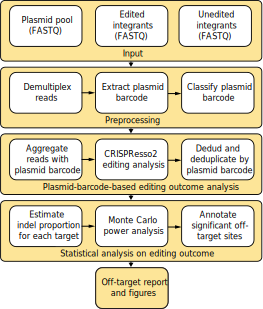

# ABSOLVE-seq: Assessment By Stand-in Off-target LentiViral Ensemble with sequencing

As CRISPR enters the clinic, it is important to consider the impact of human genetic variation on editing specificity during therapeutic development. ABSOLVE-seq enables multiplexed experimental assessment of candidate allele-specific off-target sequences in clinically relevant contexts, especially when primary cells with the haplotypes of potential concern are not available.

The `absolveseq` package implements our ABSOLVE-seq data processing and analysis pipeline. It applies rigorous statistical inference and incorporates allelic outcome predictions to enhance the signal-to-noise ratio and minimize false positives, allowing researchers to exonerate candidate off-target sequences.

## Citation

Jiecong Lin*, My Anh Nguyen*, Linda Y. Lin*, Jing Zeng, Archana Verma, Nola R. Neri, Lucas Ferreira da Silva, Adele Mucci, Scot Wolfe, Kit L Shaw, Kendell Clement, Christian Brendel, Luca Pinello#, Danilo Pellin#, and Daniel E. Bauer#. Scalable assessment of genome editing off-targets associated with genetic variants. *bioRxiv* 2024. PMID: 39211178. <https://doi.org/10.1101/2024.07.24.605019>

## Overview<a name="overview"></a>

This package implements a two-stage pipeline consisting of read preprocessing and off-target identification. The preprocessing module demultiplexes pooled multi-sample FASTQ reads into target-plasmid-specific files for CRISPResso2 analysis and filters reads with dud plasmid barcodes or recombination errors. Off-target events are then identified using generalized linear models (GLMs) for indel estimation and Monte Carlo simulations for power analysis.



## Dependencies<a name="dependencies"></a>
* Python 3.9
* tqdm
* [`CRISPResso2`](<https://github.com/pinellolab/CRISPResso2>) genome editing outcomes analysis tool

## Features<a name="features"></a>

This package provides a pipeline for ABSOLVE-seq read preprocessing and off-target identification. The preprocessing module demultiplexes raw pooled FASTQ inputs into target-plasmid-barcode-specific read files.

The individual pipeline steps are:

1. **Target Barcode Demultiplexing:** Deconvolution of pooled sequencing data into target-specific read files.
2. **Plasmid Barcode Demultiplexing**: Stratification of target-specific reads by unique plasmid barcodes.
3. **Plasmid Barcode Classification**: Identification and stratification of high-quality barcodes within the Maxi pool.
4. **CRISPResso2 Analysis**: Quantification of editing outcomes using the CRISPResso2 pipeline.
5. **Dedud & Recombination Filtering**: Removal of reads with dud plasmid barcode and recombination artifacts.
6. **Indel Estimation & Power Analysis**: Statistical assessment of insertion/deletion frequencies and experimental power.
7. **Visualization & Reporting**: Generation of summary plots and comprehensive data reports.

## Running Analysis Steps Individually<a name="individual_steps"></a>

### Installation
```bash
git clone https://github.com/pellinlab/ABSOLVE-seq.git
cd ABSOLVE-seq

conda install absolveseq_env python=3.9 tqdm
conda activate absolveseq_env
conda install -c bioconda crispresso2
```
### Trim the fastq file
```bash
bash 0_trim_fastq.sh
```

### Demultiplex fastq by target barcode (tBC)
Download test fastq files from the link in [test/data/target_fastq/source](test/data/target_fastq/source), and save them in [test/data/target_fastq/](test/data/target_fastq/). [This file](test/data/target_info/NovaSeq3_sample_info_example.csv) contains the FASTQ metadata required for demultiplexing:

```bash
python absolveseq/1_demultiplex_by_targetBarcode.py \
  --output_dir ./test/demultiplexed_tBC_fastq \
  --target_info ./test/data/target_info/LVOT_oligo_pool.xlsx \
  --sample_info ./test/data/target_info/NovaSeq3_sample_info_example.csv \
  --n_processes 8
```

### Demultiplex fastq by plasmid barcode (pBC) and analyse editing outcomes with CRISPResso2
Demultiplex fastq and preprare input files for CRISPResso2 analysis:
```bash
python absolveseq/2_demultiplex_by_plasmidBarcode.py \
  --fastq_dir ./test/demultiplexed_tBC_fastq \
  --fa_out_folder ./test/demultiplexed_pBC_fastq \
  --crispresso_input_folder ./test/CRISPResso_input_files \
  --crispresso_output_folder ./test/CRISPResso_output \
  --amplicon_fn ./test/data/target_info/OT_guide_amplicon_seq.csv \
  --n_processes 8
```
Analyse ABSOLVE-seq editing outcomes with CRISPResso2 batch mode:
```bash
bash 3_CRISPRessoBatch_absolveseq.sh
```

### Dedud ABSOLVE-seq editing outcomes via plasmid barcodes
Preprocess ABSOLVE-seq outcomes per target from CRISPResso2 derived allele tables:
```bash
python absolveseq/4_process_crispresso_output.py \
  --crispresso_result_dir ./test/CRISPResso_output/ \
  --out_folder ./test/absolveseq_edits/crispresso_allele_tables
```
Annotate ABSOLVE-seq outcomes and filter dud plasmid barcodes using the preprocessed data in [test/data/plasmid_barcode_category.tsv.gz](test/data/plasmid_barcode_category.tsv.gz):
```bash
python absolveseq/5_dedud_by_plasmidBarcode.py \
  --plasmid_barcode_annot_file ./test/data/plasmid_barcode_category.tsv.gz \
  --crispresso_alleles_dir ./test/absolveseq_edits/crispresso_allele_tables \
  --output_dir ./test/absolveseq_edits/dedud/
```
Refine ABSOLVE-seq outcomes by excluding reads with recombination errors:
```bash
python absolveseq/6_dedud_by_filteringRecomErr.py \
  --target_oligo_file ./test/data/target_info/target_oligos_sequenes.csv \
  --dedud_alleles_dir ./test/absolveseq_edits/dedud/ \
  --output_dir ./test/absolveseq_edits/dedud_filtered/
```
### Editing estimation and power analysis
Estimate editing outcomes per barcode using the deduplicated filtered ABSOLVE-seq data:
```bash
Rscript absolveseq/7_estimation.R \
  --barcode_file ./test/data/barcodeList.csv \
  --data_folder ./test/absolveseq_edits/dedud_filtered_v3 \
  --baselevel_treat NoEP \
  --number_cores 4
```
Perform power analysis based on the estimated editing outcomes:
```bash
Rscript absolveseq/8_power_analysis.R \
  --data_folder ./test/absolveseq_edits/dedud_filtered_v3 \
  --number_simulations 1000 \
  --number_cores 4 \
  --baselevel_treat NoEP
```
Plots:
```bash
Rscript absolveseq/9A_plot_heat.R \
  --data_folder ./test/absolveseq_edits \
  --experiments dedudS_filtered_v3,dedudS_filtered_v3_dedup,raw,raw_dedup \
  --format_plot svg
Rscript absolveseq/9B_plot_bar.R \
  --data_folder ./test/absolveseq_edits \
  --experiments dedudS_filtered_v3,dedudS_filtered_v3_dedup,raw,raw_dedup \
  --format_plot svg
Rscript absolveseq/9C_plot_dot.R \
  --data_folder ./test/absolveseq_edits \
  --experiments dedudS_filtered_v3,dedudS_filtered_v3_dedup,raw,raw_dedup \
  --format_plot svg
```

## Contacts
* Danilo Pellin (<danilo.pellin@childrens.harvard.edu>)
* Daniel Bauer (<daniel.bauer@childrens.harvard.edu>)
* Luca Pinello (<lpinello@mgh.harvard.edu>)