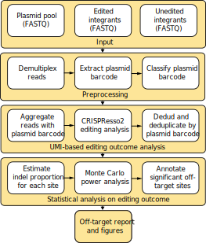

# absolveseq: The ABSOLVE-Seq Analysis Package


The absolveseq package implements our data preprocessing and analysis pipeline for ABSOLVE-Seq data.

### References

##### The original paper describing the ABSOLVE-Seq method:

Jiecong Lin, My Anh Nguyen, Linda Y. Lin, Jing Zeng, Archana Verma, Nola R. Neri, Lucas Ferreira da Silva, Adele Mucci, Scot Wolfe, Kit L Shaw, Kendell Clement, Christian Brendel, Luca Pinello, Danilo Pellin, Daniel E. Bauer
bioRxiv 2024.07.24.605019; doi: https://doi.org/10.1101/2024.07.24.605019

## Features<a name="features"></a>

This package implements a two-stage pipeline consisting of read preprocessing and off-target identification. The preprocessing module demultiplexes pooled multi-sample FASTQ reads into target-plasmid-specific files for CRISPResso2 analysis and filters reads with dud plasmid barcodes or recombination errors. Off-target events are then identified using generalized linear models (GLMs) for indel estimation and Monte Carlo simulations for power analysis.



## Dependencies<a name="dependencies"></a>
* Python 3
* [`CRISPResso2`](<https://github.com/pinellolab/CRISPResso2>) genome editing outcomes analysis tool

## Features<a name="features"></a>

This package provides a pipeline for ABSOLVE-seq read preprocessing and off-target identification. The preprocessing module demultiplexes raw pooled FASTQ inputs into target-plasmid-barcode-specific read files.

The individual pipeline steps are:

1. **Target Barcode Demultiplexing:** Deconvolution of pooled sequencing data into target-specific read files.
2. **Plasmid Barcode Demultiplexing**: Stratification of target-specific reads by unique plasmid barcodes.
3. **Plasmid Barcode Classification**: Identification and stratification of high-quality barcodes within the Maxi pool.
4. **CRISPResso2 Analysis**: Quantification of editing outcomes using the CRISPResso2 pipeline.
5. **Dedud & Recombination Filtering**: Removal of reads with dud plasmid barcode and recombination artifacts.
6. **Indel Estimation & Power Analysis**: Statistical assessment of insertion/deletion frequencies and experimental power.
7. **Visualization & Reporting**: Generation of summary plots and comprehensive data reports.

## Running Analysis Steps Individually<a name="individual_steps"></a>

### Installation
```bash
conda isntall absolveseq_env python=3.11
conda activate absolveseq_env
conda install crispresso2
```

### Demultiplex fastq by target barcode 
Downloead test fastq files from the link in test/data/target_fastq/source
```bash
python absolveseq/1_demultiplex_by_targetBarcode.py \
  --output_dir ./test/demultiplexed_tBC_fastq \
  --target_info ./test/data/target_info/LVOT_oligo_pool.xlsx \
  --sample_info ./test/data/target_info/NovaSeq3_sample_info_example.csv \
  --n_processes 8
```

### Demultiplex fastq by plasmid barcode
```bash
python absolveseq/2_demultiplex_by_plasmidBarcode.py \
  --fastq_dir ./test/demultiplexed_tBC_fastq \
  --fa_out_folder ./test/demultiplexed_pBC_fastq \
  --crispress_input_folder ./test/CRISPResso_input_files \
  --crispress_input_folder ./test/CRISPResso_output \
  --amplicon_fn ./test/data/target_info/OT_guide_amplicon_seq.csv \
  --n_processes 8
```

### CRISPResso2 analyais
```bash
bash CRISPRessoBatch_absolveseq.sh
```


